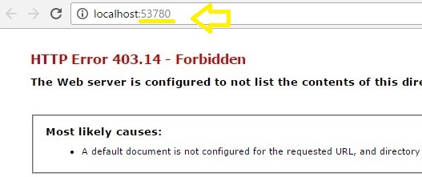

# Survey-Offline-First

How to run
=====================
Open etouches API.sln => Start (F5) =>
    => Copy the number marked with yellow
 Open Survey_Offline_First.sln => MainPage.xaml.cs =>   => Modify (paste) the PORT number at line: private const string PORT = "53780";
 => Survey_Offline_First.sln => Start (F5)
  If you are online, the form is sent to etouches API simulated on localhost.  To check it, go to http://localhost:53780/api/Survey/GetSurvey (if PORT == 53780) 
